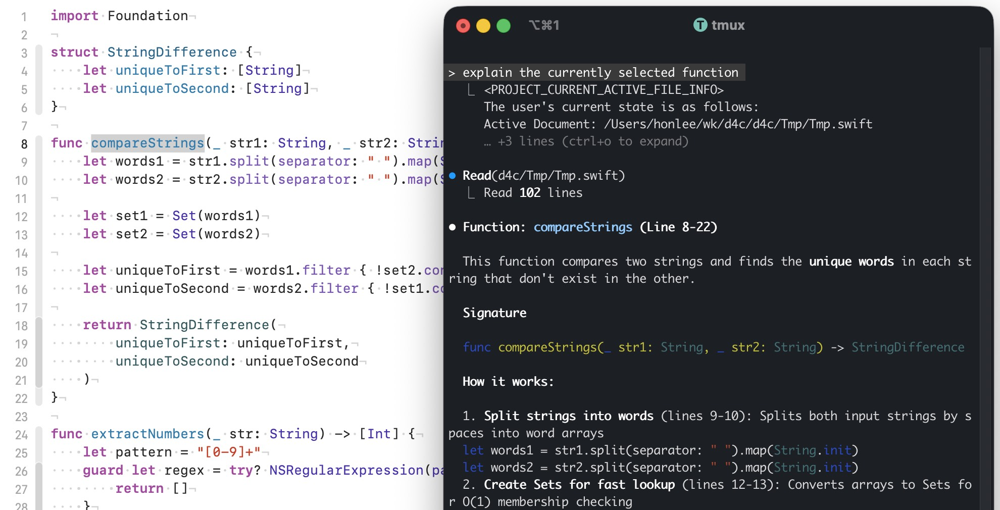

# XcodeAIStand - Xcode AI Stand

[中文文档](README_ZH.md)

Seamlessly integrate external AI Agent Clients with Xcode. Real-time editor state synchronization via MCP protocol enables AI to automatically access current file, cursor position, selected code, and other context information.

## Features

- Get active file information from Xcode editor
- Support cursor position, selection range, and detailed context
- Multiple modes: MCP Stdio, MCP HTTP, direct text output

## Use Cases

AI automatically senses your editing state in Xcode. No need to manually copy-paste code or specify context - just ask directly:

- Analyze the logic of current file
- Explain the selected code
- What's the call flow of this method
- Help me optimize this implementation



▲ iTerm2 Claude Code CLI with Xcode

## Getting Started

[XcodeAIStand Download ☘️](https://github.com/unihon/XcodeAIStand/releases)

### Permission Requirements

First run requires Accessibility permission:

**System Settings** → **Privacy & Security** → **Accessibility**

### Claude Code CLI
> Project root/.mcp.json

```json 
{
  "mcpServers": {
    "XcodeAIStand": {
      "command": "your_XcodeStand_path"
    }
  }
}
```

### Gemini CLI
> Project root/.gemini/settings.json

```json 
{
  "mcpServers": {
    "XcodeAIStand": {
      "command": "your_XcodeStand_path"
    }
  }
}
```

## Tips

If AI doesn't call XcodeAIStand during conversation, you can guide it via system prompt:

> System prompt example
```
When the question contains these keywords, must call XcodeAIStand to get current file info:
- current
- selected
- here
- cursor
...
```

## Reference

### Command Line Arguments

| Argument | Description |
|----------|-------------|
| (none) | MCP Stdio mode (default) |
| `-http` | MCP HTTP mode |
| `-bind [host]:port` | Specify HTTP bind address (default :9000) |
| `-txt` | Direct text output mode, exits after output |
| `-snippet` | Include code snippets (selected text, context before/after) |

### Run Modes

#### 1. MCP Stdio Mode (Default)

Communicate with MCP client via standard input/output:

```bash
XcodeAIStand
```

#### 2. MCP HTTP Mode

Start HTTP server, listen for MCP JSON-RPC requests:

```bash
XcodeAIStand -http                      # Default listen :9000
XcodeAIStand -http -bind 127.0.0.1:9000 # Specify address and port
XcodeAIStand -http -bind :8080          # Specify port only
XcodeAIStand -http -snippet             # Include code snippets
```

#### 3. Direct Text Output Mode

One-time output of current file info then exit:

```bash
XcodeAIStand -txt
```

### `-snippet` Argument

By default, `get_project_current_active_file_info` only returns minimal info:
- File path
- Cursor position (line, column)
- Selection range (start line:column - end line:column)

With `-snippet` argument, additionally returns:
- Selected text content
- Code snippet before cursor (100-200 chars)
- Code snippet after cursor (100-200 chars)

## MCP Interface

### Tools

| Tool Name | Description |
|-----------|-------------|
| `get_project_current_active_file_info` | Get current active file info (path, cursor, selection) |
| `get_file_content` | Get full content of specified file |
| `list_directory` | Recursively list files (ignores hidden and build dirs) |
| `get_project_structure` | Get current project file structure |

### Resources

| Resource URI | Description |
|--------------|-------------|
| `XcodeAIStand://project_current_active_file_info` | Current active file info resource |

### MCP Request Example

```bash
curl -X POST http://localhost:9000 \
     -H "Content-Type: application/json" \
     -d '{
       "jsonrpc": "2.0", 
       "id": 1, 
       "method": "tools/call", 
       "params": { 
         "name": "get_project_current_active_file_info" 
       }
     }'
```

## Output Examples

**Minimal mode (default):**
```
<PROJECT_CURRENT_ACTIVE_FILE_INFO>
The user's current state is as follows:
Active Document: /path/to/file.swift
Cursor: Line 42, Column 15
Selection Range: Line 10:5 - Line 12:20
</PROJECT_CURRENT_ACTIVE_FILE_INFO>
```

**Full mode (-snippet):**
```
<PROJECT_CURRENT_ACTIVE_FILE_INFO>
The user's current state is as follows:
Active Document: /path/to/file.swift
Cursor: Line 42, Column 15
Selection Range: Line 10:5 - Line 12:20
Selected Text:
...
Previous Snippet:
...
Next Snippet:
...
</PROJECT_CURRENT_ACTIVE_FILE_INFO>
```

## Building

```bash
# Debug build
swift build

# Release build (recommended, better performance)
swift build -c release
```

Build output paths:
- Debug: `.build/debug/XcodeAIStand`
- Release: `.build/release/XcodeAIStand`

---

<div align="center">
<a href='https://ko-fi.com/V7V61RL0IZ' target='_blank'></a>
</div>
